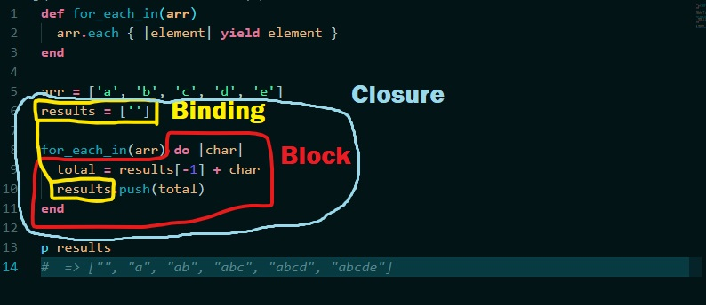
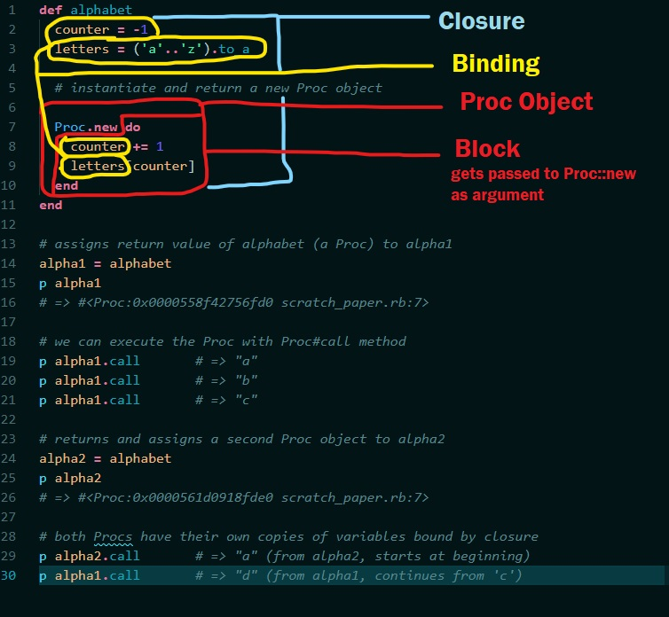
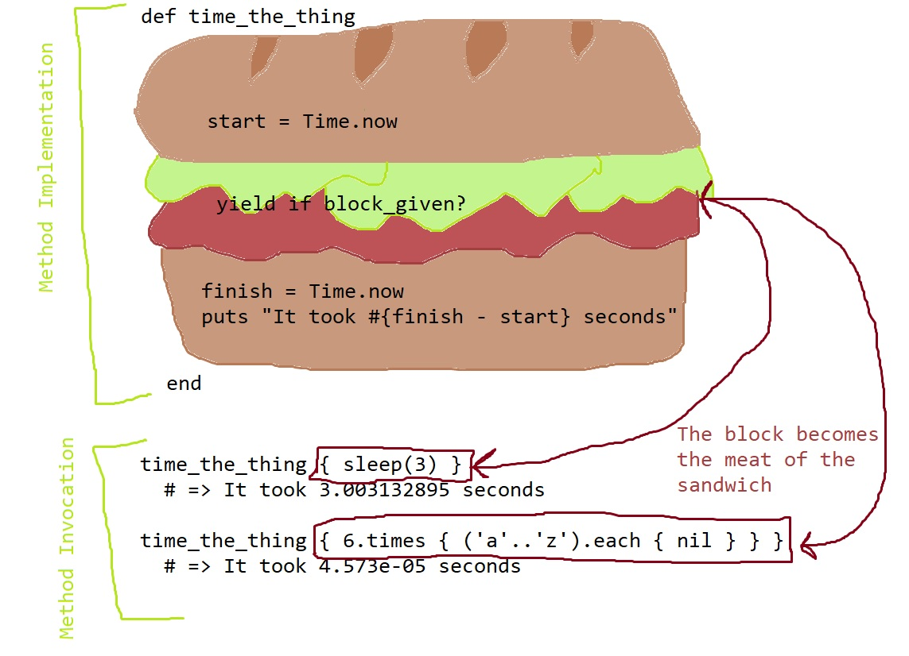

# Blocks

- [Closures](#closures)
- [Variable Scope and Binding](#variable-scope-and-binding)
- [What are blocks?](#what-are-blocks?)
- [Writing methods that take blocks](#writing-methods-that-take-blocks)
  - [Passing Execution to a Block](#passing-execution-to-a-block)
  - [Yielding with an Argument](#yielding-with-an-argument)
  - [Return Value of a Block](#return-value-of-a-block)
- [Use Cases for Blocks](#use-cases-for-blocks)
  - [Deferring Implementation](#defer-implementation)
  - [Sandwich Code](#sandwich-code)
- [Explicit Block Parameters](#explicit-block-parameters)
- [Symbol to Proc](#symbol-to-proc)
- [Arity](#arity)
- [Blocks vs Procs vs Lambdas](#blocks-vs-procs-vs-lambdas)

## Closures

A **closure** is an abstract programming concept that exists across multiple languages. It refers to a "chunk of code" that can be saved, somehow, and executed at a later time, possibly from a different location. Closures work by **binding** their _surrounding artifacts_, which can include variables, methods, objects, or other pieces of data and code.

This **binding** creates an _enclosure_ around all the artifacts so that they can be referenced at such a time as the closure is executed. That means that closures can use and even update local variables that are in scope for them when they are executed, _even if the call for execution comes from a place in the code where these variables are not in scope_.



Above, you can see how a closure (in this case, a block) binds surrounding local variables and references them during execution. The block itself begins with the `do` keyword and contains all the code up until the `end` keyword. Note that within our block implementation, we have access to the local variable `results`, which was initialized on line 6 to the value `['']`. This is because blocks have access to variables initialized in outer scope. The closure created by the block can retain a memory of this variable and its value via a binding.

When we invoke this block from within the `for_each_in` method with the `yield` statement on line 2, we can still access the local variable `results`, even though it is never passed into the method. This works because the block passed to `for_each_in` represents a closure, and binds the local variable `results` to itself.

The code within the block mutates this array, adding the value referenced by `total` as a new element for each iteration through the block. Therefore, when we output the `results` array on line 13, we will see the updated value `["", "a", "ab", "abc", "abcd", "abcde"]`.

In Ruby, **blocks**, **Procs**, and **lambdas** are all ways to implement a closure. Note that a `Proc` is an actual object instantiated from the `Proc` class, a lambda is really a special kind of these `Proc` objects, and a block _is not an object_.

A block isn't an object, so it isn't a value that we can return. However, a `Proc` _is_ an object, it's an instance of the `Proc` class. It's also a closure. That means we can actually assign closures to variables and pass them around. It also means that we can return them from either a method or a block.



Above, we define the method `alphabet` such that it returns a `Proc` object. This `Proc` forms a closure with local variables `counter` and `alphabet`. We invoke this method on line 14 and assign the returned `Proc` to the local variable `alpha1`. Now that the `Proc` is captured by a variable, we can invoke it whenever we want with the `Proc#call` method.

When we execute the `Proc`, it has its own private copy of `counter` and `alphabet`. The copy of `counter` gets incremented, but only for this particular `Proc` object. This is evident by the fact that we progress through the letters of the alphabet with each time we invoke the `Proc`.

We also have the capability to invoke `alphabet` again and return a new `Proc` object. When we call `alphabet` and assign the return value to `alpha2` on line 24, it represents a second instance of `Proc` that has its own separate copy of local variables `counter` and `letters`. Therefore, when we invoke `Proc#call` on it, we begin again with the letter `'a'`, because `counter` references `0`. In `alpha1`, on the other hand, we will get `'d'` by invoking the `Proc`, because in that case `counter` points to `3`.

## Variable Scope and Binding

_Quick review_:

A block creates a new scope for local variables (this is really only applicable to local variables). A local variable initialized in outer scope is available to a block. A local variable initialized in inner scope is not available in outer scope.

[Closures](#closures) keep track of the local variables that are in scope for them via a **binding**. A **binding** consists of the _surrounding environment_ or _context_ for a closure. This can include local variables, method calls/references, constants, or any other kind of artifacts. Basically, the closure will **bind** and drag around with it anything it needs to function correctly.

This can result in seeming violations of scoping rules for things like local variables. Let us use the example of a `Proc`, which is an object that gets explicitly passed into a method. Recall that to execute a `Proc` object we use the `Proc#call` method:

```ruby
def introduce_yourself(introduction)
  introduction.call
end

me = "Ginni"

my_bit = Proc.new { puts "Hello, my name is #{me}." }

introduce_yourself(my_bit)
# Hello, my name is Ginni.
```

Above, we first initialize local variable `me` and assign it the string object `"Ginni"`. Next, we instantiate a new `Proc` object and assign it to the local variable `my_bit`. Note that the new `Proc` object utilizes a block that accesses the local variable `me`.

Next, we pass the `Proc` object referenced by `my_bit` into the method `introduce_yourself`. Within the method, the `Proc` is called, and we get the output `Hello, my name is Ginni`. How does the `Proc` access the value referenced by local variable `me`? By virtue of its **binding**.

In order for local variables to be a part of a closures binding, **they must be initialized before the closure is created** unless they are explicitly passed into the closure.

For example:

```ruby
def introduce_yourself(introduction)
  introduction.call
end

my_bit = Proc.new { puts "Hello, my name is #{me}" }

me = "Ginni"

introduce_yourself(my_bit)
# Raises NameError: undefined local variable or method `me`
```

The above code does not work, because the local variable `me` is initialized after the closure is created.

However, if you initialize a local variable before creating a closure, access it within the closure, _and then reassign that local variable_, the last assigned value will be reflected when the closure is executed:

```ruby
def introduce_yourself(introduction)
  introduction.call
end

me = "Ginni"

my_bit = Proc.new { puts "Hello, my name is #{me}" }

me = "Other Ginni"

introduce_yourself(my_bit)
# Hello, my name is Other Ginni
```

Notice in the above example, how the `Proc` referenced by `my_bit` is aware of the new value assigned to `me`, despite the fact that this reassignment takes place _after the `Proc` is created_.

## What are Blocks?

In Ruby, **blocks** are sections of code that are surrounded by `do...end` or `{ .. }`. They are passed as arguments to a method call. Any method can accept an implicit block, but only those that implement their execution with some sort of call to `yield` will execute the code inside the given block. How the method which takes the block is implemented determines how the return value of the block is used, if at all.

```ruby
# each executes a given block, but ignores its return value
['a', 'b', 'c'].each { |letter| puts letter.upcase }
# outputs: A B C each on a new line
# => ['a', 'b', 'c']

# times executes a given block, but ignores its return value
3.times { |i| i += 5 }
# => 3

# upcase can take a block, but it will not execute it
letter = 'a'
letter.upcase { puts letter }
# no output, the block is not executed
# => 'A'

# map executes a given block, uses the return value for transformation
['a', 'b', 'c'].map { |letter| letter.upcase }
# => ['A', 'B', 'C']

# select executes a given block, uses the return value for selection
['a', 'B', 'c'].select { |letter| letter =~ /[a-z]/ }
# => ['a', 'c']
```

Documentation tells us which methods can utilize a block, and how that block is used by the method.

## Writing Methods that take Blocks

To define a method that takes a block, utilize the keyword `yield`. This will execute any block that gets passed to the method in question as an argument. Ostensibly, it allows any other person, whether another developer or yourself in the future, to "inject" a section of code into the method that you have defined.

```ruby
def execute_block
  puts "Oh, did someone pass me a block?"
  yield
  puts "Cool! Well done!"
end

execute_block { puts "Yes sir, and here I am!" }

# => "Oh, did someone pass me a block?"
# => "Yes sir, and here I am!"
# => "Cool! Well done!"
```

If a method is implemented with a `yield` statement, but is passed no block, it will result in a `LocalJumpError`

```ruby
def execute_block
  puts "Oh, did someone pass me a block?"
  yield
  puts "Cool! Well done!"
end

execute_block
# raises: LocalJumpError (no block given (yield))
```

Make your `yield` statements more flexible by including them in a conditional that utilizes the `Kernel#block_given?` method. This will return `true` if a block is passed to the method in question and `false` if not.

```ruby
def execute_block
  puts "Oh, did someone pass me a block?"
  yield if block_given?
  puts "Cool! Well done!"
end

execute_block { puts "Yes and here I am!" }
# Oh, did someone pass me a block?
# Yes and here I am!
# Cool! Well done!

execute_block
# Oh, did someone pass me a block?
# Cool! Well done!
```

### Passing Execution to a Block

`yield` works by **passing execution to the block**. That is, it actually causes execution to move to where the block is defined (the closure) and execute the code within. Then, it will move back to where execution was before, and complete execution of the method to which we passed the block.

This implies a distinction between _method implementation_ and _method invocation_. Method implementation is where we define the method. This is where execution jumps to when we call a method to begin with. Method invocation is where we call the method. If we are working with a method that takes a block, passing the block happens during method invocation, not implementation. The block in question allows us to **refine the method implementation in a flexible way** without actually changing the other implementation steps of the original method we're calling.

For example:

```ruby
def town_crier(words)
  yield if block_given?
  puts "*** Here ye! Here ye! ***"
  puts "*** #{words} ***"
end

town_crier("Welcome to town!") { system 'clear' }
# clears the screen
# *** Here ye! Here ye! ***
# *** Welcome to town! ***

town_crier("The King Approaches!") { puts "Make way, ye peasants!" }
# Make way, ye peasants!
# *** Here ye! Here ye! ***
# *** The King Approaches! ***
```

In the above examples, the execution begins at the first _method invocation_ when we call `town_crier` with the string argument `"Welcome to town!"` and a block. Then, execution goes to _method implementation_, or where we have defined the `town_crier` method. `"Welcome to town!"` is assigned to the parameter `words`.

The next line yields to the given block. This means that execution jumps back to _method invocatiOn_ to find the closure represented by the block. In this case, it includes the statement `system 'clear'`. This is executed, and the screen is cleared.

Now that the block has been executed, execution goes back to the _method implementation_ and proceeds with the rest of the method. It will first output the string `"*** Here ye! Here ye! ***"` and then the string `"*** Welcome to town! ***"`.

The next time we call `town_crier` we pass different code in the block, so the method behaves slightly differently, without actually altering it's previously written implementation steps. Like before, execution begins at _method invocation_ when we call `town_crier` and pass the arguments `"The King Approaches!"` and a block. Execution then jumps to _method implementation_, and the string `"The King Approaches!"` is assigned to the parameter `words`.

Next, the method yields to the block, and execution again jumps back to _method invocation_. The block consists of the string `"Make way, ye peasants!"` passed to `puts`, so this string is output, and the block returns `nil`. Execution jumps back to _method implementation_. `town_crier` ignores the return value of the block, and proceeds to the next line. Again the strings `"*** Here ye! Here ye! ***"` and `"*** The King Approaches! ***"` are output to the screen.

Finally, the `town_crier` method returns `nil` and execution is done.

### Yielding with an Argument

It may be the case that the block we wish to pass into the method requires some kind of argument. We can make this happen with two additional steps, one at _method implementation_ and one at _method invocation_:

1. _Method Implementation_: Adding an argument to the `yield` statement, i.e. `yield(argument_to_pass)`
2. _Method Invocation_: Defining the block with a **block parameter**, i.e. `{ |block_parameter| # code goes here }`

Note: The block parameter is also known as a **block local variable**. This is a special type of local variable, whose scope is constrained to the block. It is imperative that we ensure the block parameter has a unique name and does not conflict with other local variables outside the block. This will result in _variable shadowing_.

When might we want to utilize a block that takes an argument? If we want to allow _users_ (the person invoking the method) to take some action on a value that exists within the method, and we aren't sure what that action might be. Blocks allow us the flexibility to define this action later, at invocation time.

The `each` method is an excellent example of this. `each` gets passed some kind of collection. The method iterates over the collection, and yields each element in turn to the block that gets passed to it. This is because we know the user wants to do _something_ to the collection's elements, but we're not sure what yet. They may want to output them, log them into a file, or mutate them in some way. Allowing the user to define this action with a block during invocation gives us this flexibility. Each element, in it's turn, represents the argument we pass into the block and assign to the block parameter.

```ruby
def for_each_in(array)
  counter = 0
  while counter < array.size
    yield(array[counter]) if block_given?
    counter += 1
  end
  array
end

for_each_in([1, 2, 3, 4]) { |num| puts num }
# 1
# 2
# 3
# 4

hello = ['g', 'd', 'k', 'k', 'n']
for_each_in(hello) { |letter| puts letter.next }
# h
# e
# l
# l
# o
```

Above, we have defined a method `for_each_in` which takes an array argument. It iterates through the elements of the array, yielding each in its turn to the block, if given. It then returns the original array.

We first call `for_each_in` and pass it the array `[1, 2, 3, 4]` as argument. The block represents the action we want to take on each element in the array. In this case, we define the block with block parameter `num`, to which the current element will be assigned for each iteration of the block. Then we output `num` using `puts`.

Code execution proceeds like this:

- First we invoke `for_each_in` and pass it the array `[1, 2, 3, 4]`.
- Execution jumps to method implementation. `[1, 2, 3, 4]` gets assigned to the parameter `array`.
- Local variable `counter` is initialized to `0`.
- We enter a `while` loop that executes until `counter < array.size` evaluates to `false`
- The current element of the array `array[counter]` (which references `1`) is yielded to the given block.
- Execution jumps back to method invocation. `1` is assigned to the block parameter `num`.
- The block is executed and `num` is output. The block returns `nil`.
- Execution jumps back to method implementation. `for_each_in` ignores the return value of the block.
- `counter` is incremented by `1`
- The process repeats until we iterate through the entire array
- `for_each_in` returns the original array

Next we call `for_each_in` on a different collection. This time we pass in the array referenced by local variable `hello` (or `['g', 'd', 'k', 'k', 'n']`). The flexibility of our method, because it yields to a block, allows us to perform an entirely different set of actions on an entirely different datatype, without actually changing the implementation of `for_each_in` at all.

Here, we are dealing with strings. Just as before, each string is yielded to the block in it's turn, where it is assigned to the block parameter `letter`. In this case, we have defined the block to output the value returned by `letter.next`. This results in `'h'`, `'e'`, `'l'`, `'l'`, `'o'` being output in turn.

**Note**: Unlike methods, if you pass the wrong number of arguments to a block, it will not throw an error. This is known as **lenient arity**. For more information on this see [arity](link-goes-here). *needs link

### Return Value of a Block

Like methods, blocks have a return value and this is determined by the last expression in the block. Whatever that expression evaluates to will be implicitly returned by the block. This value can be captures and utilized when execution returns to the method implementation that yielded to the block.

We can capture the return value of a block by assigning it to a local variable inside the method. This value, then, can be called up at any time and evaluated or manipulated.

```ruby
def before_and_after(obj)
  puts "Before: #{obj}"
  after = yield(obj)      # capture the return value of the block
  puts "After: #{after}"
end

before_and_after(0) { |num| num + 5 }
# Before: 0
# After: 5

before_and_after('good morning') { |greeting| greeting + "!!" }
# Before: good morning
# After: good morning!!
```

We can also utilize return values in other statements, such as conditionals. For example, the `Array#select` method uses the return value of a block and evaluates it for truthiness.

```ruby
def select_elements(array)
  results = []
  counter = 0
  while counter < array.size
    current_element = array[counter]
    # evaluate the return value of the block for truthiness
    results << current_element if yield(current_element)
    counter += 1
  end
  results
end

select_elements(%w(a B C d e F)) { |letter| letter =~ /[A-Z]/ }
#  => ["B", "C", "F"]

select_elements([1, 2, 3, 4]) { |num| num.odd? }
#  => [1, 3]
```

Just as methods should _either_ return a meaningful value _or_ perform some kind of side-effect action (output value, mutate a value) so should blocks. Keep the distinction between these two "types" of actions and keep them apart in both your methods and blocks.

```ruby
def before_and_after(obj)
  puts "Before: #{obj}"
  after = yield(obj)      # capture the return value of the block
  puts "After: #{after}"
end

# this is bad (returns meaningful value and performs mutation):
before_and_after('hello') { |word| word.upcase! }
# Before: hello
# After: HELLO

# this is good:
before_and_after('hello') { |word| word.upcase }
# Before: hello
# After: HELLO
```

## Use Cases for Blocks

### Defer Implementation

If you have a case where you are trying to implement a method, and you are not 100% sure of how it will be called during invocation time, you can leave this ambiguity to be decided at invocation time in the form of a block. A scenario like this might look like a method that you are calling from multiple places, with one little tweak in each place. Instead of defining a bunch of similar yet different methods, try to define a single method in a more general way, and leave the "tweaks" to be executed by a block during method invocation.

Take the example of methods like `min_by`. `min_by` returns the minimum element in a collection _based on the return value of a given block_. This means that instead of only being able to return the absolute minimum value, we can specify the means by which we would like to determine "minimum". It might be the shortest length of a string, the word with the least amount of vowels, or any number of different criteria. The point is, we don't have to define this criteria _until we invoke the method_. Further, once this criteria is defined, _it does not affect the other implementation steps of the method_.

```ruby
# Given an array, find the minimum element based on some unknown criteria to be determined in the future.

def min_by(arr)
  min_ele = arr[0]
  min_val = yield(arr[0])
  
  arr.each do |ele|
    current_val = yield(ele)
    next unless current_val < min_val
    min_ele = ele
    min_val = current_val
  end
  
  min_ele
end

arr = %w(aaa bbbb ca aabbc)
p min_by(arr) { |str| str.size }        # => 'ca'
p min_by(arr) { |str| str.count('a') }  # => 'bbbb'
```

### Sandwich Code

**Sandwich code** describes methods that need to perform some kind of "before" and "after" actions. This can include timing some process, logging something, or some kind of notification system. It also includes resource management, or interfacing with the operating system. For example, when dealing with files, we first need to allocate memory to open the file. Then, once we do whatever it is we want to do with the file in question, we want to close the file and clean up the memory allocation. Sandwiching a block in between these two steps allows us to automate the set up and clean up process.



The above graphic depicts a method that times and outputs how long _some action_ takes. The method itself does not care about what the action is at all. Its sole purpose is to time the action, and output the time it took to execute the action. We use a block to allow any action the method caller wants to be specified at the time the method is invoked. The implementation of our method times the action, and does not change at all regardless of what the action is.

A built-in example of sandwich code is `File::open`. We can call `File::open` in two ways:

1. With an argument specifying the name of the file to open, and no block. In this case, we must open the file in one step, take any action we wish to take on the file in another step, and then explicitly close the file once we are done with it

    ```ruby
    file = File.open('a_file.txt', 'w+')
    # do something with the file
    file.close
    ```

2. With an argument specifying the name of the file to open, and with a block containing the action we want to take on the file in question. In this case, `File::open` will open the file, perform the specified action, and close the file automatically. The method returns the return value of the block.

    ```ruby
    File.open('a_file.text', 'w+') do |file|
      # do something with the file
    end
    ```

The necessary cleanup of opening a file (closing it) is _automated_ by the implementation of `File::open`. This means that when using `File::open` all we have to worry about as the method caller is passing in the relevant file manipulation code, and let `File::open` worry about set up and take down.

## Explicit Block Parameters

All methods in Ruby can take an implicit block. An implicit block is one that is passed to a method call as an argument, without being named explicitly or assigned to a parameter once passed into the method. Because of this, an implicit block is essentially anonymous. The only way we can handle, or execute, the block within the method is with a call to `yield`, passing along any arguments it may require. We can save its return value into a local variable but not the block itself.

It is, however, possible to assign an **explicit block** to a parameter. This block gets treated as a _named object_, and therefore can be passed around, referenced, reassigned, invoked multiple times, and manipulated in a way that an implicit block cannot. Essentially, the way we do this is to **convert the block argument into a Proc**.

_To Convert A Block Into A Proc_:

- Add a parameter with an arbitrary name prepended with unary `&` to the end of the list of parameters in the method definition.
- This saves the block passed to the method as a `Proc` object, which can be referenced or passed around via the parameter
- To reference the Proc inside the method, call the parameter (variable) without the `&`.
- When you want to execute it, invoke the `Proc#call` method on it.

```ruby
def make_a_proc(&block)
  puts "Object created by &block, referenced by block:\n#{block}"
  puts block.call # we do not include & when referencing the Proc
end

make_a_proc { 'does something' }
# Object created by &block, referenced by block:
# <Proc:0x00005610b3ac6df8 solution.rb:5>
# does something
```

Now that we have a way to reference the `Proc` object, we can even pass it to other methods.

```ruby
def passing_around_1(&block)
  puts "--- From passing_around_1 ---"
  puts "Looks like someone has invoked me with a block"
  puts "I've saved it as a Proc"
  puts "Now I'm going to give it away."
  puts
  passing_around_2(block)
  puts
  puts "--- Back to passing_around_1 ---"
  puts "That was a ball! Let's do more soon!"
end

def passing_around_2(now_a_proc)
  puts "--- Now in passing_around_2 ---"
  puts "What's this? I've found a Proc!"
  puts
  now_a_proc.call
  puts
  puts "--- Back in passing_around_2 ---"
  puts "^^ That was the execution of the Proc!"
end


passing_around_1 do
  puts "--- From inside the block ---"
  puts "I started out as a block"
  puts "Now I have a name and can get passed around!"
  puts "Thanks method friends!"
end

# OUTPUT:
# --- From passing_around_1 ---
# Looks like someone has invoked me with a block
# I've saved it as a Proc
# Now I'm going to give it away.

# --- Now in passing_around_2 ---
# What's this? I've found a Proc!

# --- From inside the block ---
# I started out as a block
# Now I have a name and can get passed around!
# Thanks method friends!

# --- Back in passing_around_2 ---
# ^^ That was the execution of the Proc!

# --- Back to passing_around_1 ---
# That was a ball! Let's do more soon!

```

Let us say that we want to build a simple guessing game. The game will randomly select a number from an arbitrary range of numbers. We, the user, want to pass a block in which will test to see if the "guess" was correct. But we want to save this as an instance variable in the game, so that we can utilize this in various methods and call it whenever, and wherever, we want. In order to accomplish this, we need to pass the block in as an explicit parameter. That is, we need to convert it into a `Proc`.

```ruby
class Guesser
  attr_reader :range, :tester

  def initialize(range, &tester) # note the block is always last parameter
    # saves the resulting Proc to instance variable tester
    @range, @tester = range, tester
  end

  def take_a_guess
    guess = range.to_a.sample
    if tester.call(guess) # execute the block and pass guess as argument
      puts "Yay! I guessed #{guess} correctly!"
    else
      puts "Boo hoo, my guess #{guess} was wrong."
    end
  end
end

# local variable `guess` from take_a_guess is assigned to block parameter `g`
# the block here will get assigned to @tester
guessing_game = Guesser.new(1..10) { |g| guess == 7 }

guessing_game.take_a_guess
# Yay! I guessed 2 correctly!

guessing_game.take_a_guess
# Boo hoo, my guess 1 was wrong

guessing_game.take_a_guess
# Boo hoo, my guess 5 was wrong
```

TL;DR: If you want to do anything in your method with a block other than execute it with `yield`, then you really want a `Proc`. We create a `Proc` by calling a method with an **explicit block parameter** (`&parameter`). Now the block has been converted into an object that can be referenced and passed around. There is really no other way to convert a block to a `Proc` because the only place that blocks exist are in method invocations.

## Symbol to Proc

Alright, so we know we can create a `Proc` out of a block by passing a block to a method as an explicit parameter. That is, by applying unary `&` to a named method parameter that expects a block.

```ruby
def take_a_guess(range, &my_guess)
  guess = range.to_a.sample
  if my_guess.call(guess) # test truthiness with Proc
    puts "Yay! My guess #{guess} was correct!"
  else
    puts "Aw, my guess #{guess} was incorrect."
  end
end

# pass a block as argument to be converted to Proc
take_a_guess(1..10) { |g| g == 5}
# => Yay! My guess 5 was correct! (results may vary)
```

We can also do the reverse of this. By passing a `Proc` _argument_ with the unary `&` to a method that expects a block we can effectively convert that `Proc` into a block.

```ruby
def take_multiple_guesses(range, &my_number)
  guesses = []
  3.times { guesses << range.to_a.sample }
  
  # recall that we currently have the Proc my_number
  # but the any? method expects a block
  # convert the Proc to a block by passing as argument with &
  if guesses.any?(&my_number)
    puts "#{guesses} includes your number!"
  else
    puts "Aw, #{guesses} does not include your number."
  end
end

take_multiple_guesses (1..15) { |g| g == 5 }
# 5, 5, 7 includes your number!
```

- When `&` is in a method definition:
  - It is being used to describe an explicit block _parameter_
  - It expects to take a block
  - It will return a converted `Proc` from the block
- When `&` is in a method invocation:
  - It is being used to help pass a `Proc` (or Symbol) as an argument to a method that expects a block
  - It expects to take a `Proc`
  - Will return a block that was converted from the given `Proc`

When `&` expects a `Proc` (in the case of being used during method invocation), and it doesn't receive one, it will automatically call `#to_proc` on the object that it received and try and convert it to a `Proc`.

If the object in question does not have a `to_proc` method and cannot be converted, this will raise an error. However, there is also a useful shortcut with symbols implied by this that we can take advantage of.

When pairing `&` with a symbol, we are basically saying, take the method that this symbol represents and create a `Proc` that calls this method on the object that gets passed to it. Subsequently, this `Proc` can be acted on by unary `&` to convert it into a block.

This allows us to pass symbols with unary `&` into method that expect blocks, when we are passing in a very simple block.

```ruby
proc1 = :upcase.to_proc
# => #<Proc:0x0000562c4d59b6e8(&:upcase) (lambda)>

proc2 = Proc.new { |str| str.upcase }
# => #<Proc:0x0000562c4d56ae08 (irb):38>

array = %w(a b c d e)

# pass the Proc with & to a method that expects a block
array.map(&proc1)
# => ['A', 'B', 'C', 'D', 'E']

array.map(&proc2)
# => ['A', 'B', 'C', 'D', 'E']

# we know that & will automaticall call to_proc so:
array.map(&:upcase)
# => ['A', 'B', 'C', 'D', 'E']
# has the same results as the other two methods
```

Note that this shortcut **only works for blocks that consist of a single method call on a single block parameter**. It does not work for methods that require an argument.

Steps:

1. We pass an object to `&`. If it is a `Proc`, this is converted to a block.
2. If it is not a `Proc`, `&` will call `to_proc` on the object. If the object is not then converted to a `Proc`, an error will be raised.
3. Now we have a `Proc` that can be converted to a block with `&`.

## Arity

**Arity** refers to _rule regarding the number of arguments you can pass_ when dealing with methods, blocks, procs and lambdas.

Methods have **strict arity**. This means that you must pass the exact number of arguments specified in their definitions, otherwise an error will be raised.

```ruby
def no_arguments
  puts "I take no arguments"
end

def one_argument(str)
  puts "I take one argument: #{str}"
end

def two_arguments(str1, str2)
  puts "I take two arguments: #{str1} and #{str2}"
end

no_arguments              # I take no arguments
no_arguments('hi')        # ArgumentError
no_arguments ('a', 'b')   # ArgumentError

one_argument              # ArgumentError
one_argument('hi')        # I take one argument: hi
one_argument('a', 'b')    # ArgumentError

two_arguments             # ArgumentError
two_arguments('hi')       # ArgumentError
two_arguments('a', 'b')   # I take two arguments: a and b
```

Blocks and Procs, on the other hand, have **lenient arity**, which means no errors will be raised if too few or too many arguments are passed to the block or `Proc` in question.

```ruby
def test
  # pass only one argument to a block
  yield('hello')
end

# define a block with two parameters
test { |a, b| puts "a: #{a}, b: #{b}" }
# Output:
# a: hello b:

# define a block with no parameters
test { puts "I don't take any arguments" }
# I don't take any arguments
```

Above, we define the method `test` to yield one argument, the string `'hello'` to a block. Then, we invoke `test` and pass a block with two block parameters `a` and `b`. No errors are raised, however. Instead, Ruby will consider any extra parameters to reference `nil`. Therefore, `b` will reference `nil` and the statement will still be output as shown above.

Next, we invoke `test` with a block that has no parameters, i.e. it doesn't take any arguments. The argument passed with `yield` within the method, however, is just ignored, and the string we initialize in the block is output, unaffected.

Procs behave similarly to blocks in this way. Lambdas, on the other hand, have **strict arity**, like methods, and so much be passed the correct number of arguments to function.

### Blocks vs Procs vs Lambdas

_Blocks_:

- Have lenient arity.
  - can be executed even if the expected arguments are not passed
  - extra parameters will reference `nil`
  - can be executed if extra arguments are passed
  - extra arguments will be ignored
- Methods that expect blocks (i.e. contain the keyword `yield`) must be passed a block.
  - `yield` without a guard clause (such as `block_given?`) that does not receive a block will result in a `LocalJumpError` being raised.
- Can only access values that have been passed on, or those that were initialized in outer scope (via its binding)

```ruby
def block_method_1(animal)
  yield
end

def block_method_2(animal)
  yield(animal)
end

block_method_1('seal') { |seal| puts "This is a #{seal}." }
# => This is a .
block_method_1('seal')
# LocalJumpError (no block given)
block_method_2('turtle') { |turtle| puts "This is a #{turtle}." }
# => This is a turtle.
block_method_2('turtle') do |turtle, seal|
  puts "This is a #{turtle} and a #{seal}"
end
# => This is a turtle and a .
block_method_2('turtle') { puts "This is a #{animal}" }
# NameError undefined local variable or method `animal`
```

_Procs_:

- A special kind of object in Ruby that exemplifie3s a closure
- Has its own class
- Can be assigned to a variable and passed around
- Can be returned by a method and reused
- Has lenient arity similar to blocks

```ruby
my_proc = proc { |thing| puts "This is a #{thing}." }
puts my_proc        # #<Proc:0x000055b34f607180 02.rb:2>
puts my_proc.class  # Proc
my_proc.call        # This is a . (no ArgumentError)
my_proc.call('cat') # This is a cat.
```

_Lambdas_:

- A special kind of `Proc` object in Ruby that exemplifies a closure.
- Does not have its own class (lambdas are instances of `Proc`)
- Can be assigned to a variable and passed around
- Initialized with `Kernel#lambda`, which is equivalent to `Proc.new`, except that the resulting `Proc` objects check the number of parameters passed when called
- Has strict arity, must be passed the correct number of expected arguments.

```ruby
my_lambda = lambda { |thing| puts "This is a #{thing}." }
my_second_lambda = -> (thing) { puts "This is a #{thing}." }
puts my_lambda          # #<Proc:0x0000556df7beedc0 02.rb:15 (lambda)>
puts my_second_lambda   # #<Proc:0x0000556df7beed48 02.rb:16 (lambda)>
puts my_lambda.class    # Proc
my_lambda.call('dog')   # This is a dog.
my_lambda.call          # ArgumentError
my_third_lambda = Lambda.new { |thing| puts "This is a #{thing}." }
# NameError (uninitialized constant Lambda)
```
